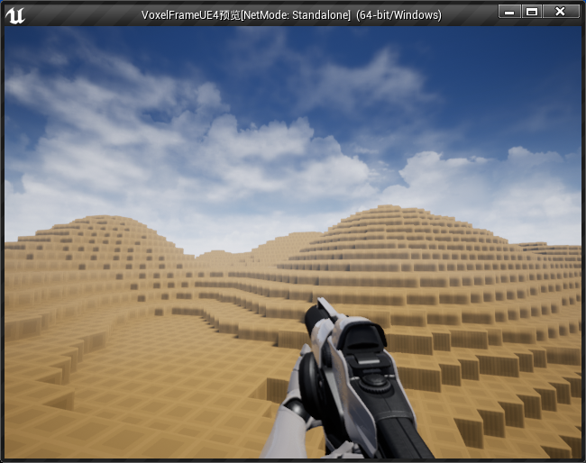
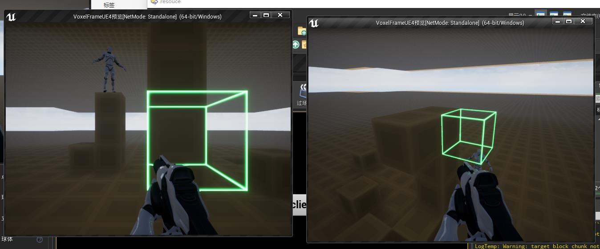

开发具体过程记录

## 2022/9/16

将区块分开成不同的材质进行网格构建，以备后续可以不同方块不同材质

## 2022/9/3

学了下unreal 的slate ui 库，还不错, 把chunk贴图显示到了界面上


## 2022/9/2


## 2022/8/28

服务端加入了区块遍历器，用于更方便的实现方块遍历和处理的逻辑

3层泥土下面加入了rock

## 2022/8/3

实现柏林噪声地形



## 2022/8/2

区块间连接处的网格生成，判断方块是否存在



## 2022/4/16

已经有材质啦


## 2022/4/15

重构网格构建部分的代码，结果出bug了。找了大半天bug，发现是计算方块世界坐标那里错了

#### 2022/4/13

- todo

  - 方块材质

    - 1.读取图片文件

      - [FFileHelper | Unreal Engine Documentation](https://docs.unrealengine.com/4.27/en-US/API/Runtime/Core/Misc/FFileHelper/)

      - [ LoadFileToArray](https://docs.unrealengine.com/4.27/en-US/API/Runtime/Core/Misc/FFileHelper/LoadFileToArray/1/index.html)

      - [FPaths | Unreal Engine Documentation](https://docs.unrealengine.com/4.27/en-US/API/Runtime/Core/Misc/FPaths/)

      - 需要获取文件夹下的文件列表，通过FFileManagerGeneric

        - ```c++
          FFileManagerGeneric::Get().FindFiles(block_textures,
          			*block_texture_dir, TEXT(".png"));
          ```

      - 文件命名

        - 方块uv类型：目前有一种，UpSideDown
        - Grass_Up.png Grass_Down.png Grass_Side.png

    - 2.图片拼接stb_image

      - 使用了一个cpp封装stbipp
      - 

  - 

#### 2022/4/12

- mainplayer同步策略

  - sync to server

    - 玩家主动操作中，将对应数据更新到NetSyncData 组件中
    - ecs系统每帧判断玩家是否做了主动操作，如果有，则将玩家当前状态发给服务器，
      - 判断结束记得清空

  - sync from server

    - ps_check_entity_move

      - part server会轮询entity是否发生位置变动，若发生，会加入到map中，并在帧结尾的ecs sys中一次性发给客户端

    - 暂时全部直接赋值（传递来的数据是vf_坐标，赋值到ue需要转换）

      - 目前的缺点，直接矫正造成的主角操纵不流畅

    - todo

      参考文献：[How do multiplayer games sync their state? Part 1 | by Qing Wei Lim | Medium](https://medium.com/@qingweilim/how-do-multiplayer-games-sync-their-state-part-1-ab72d6a54043)

      提到了reconcilation

      - 如果为mainplayer，
        - 
      - 如果为普通entity，直接赋值

#### 2021/8/27-28

- [x] 根据解析的数据创建chunk

  细节：解析的区块数据在proto中是string类型。赋值会进行深拷贝（[C++ std::string写时复制与深浅拷贝 - 不写诗的诗人小安 - 博客园 (cnblogs.com)](https://www.cnblogs.com/anhongyu/p/14108117.html)）所以我使用了swap，直接将其内存交换给chunk,避免了不必要的内存创建和拷贝，减少内存波动

- [ ] 人物移动数据，同步给服务器

  - [x] 客户端发送需要先解决一个线程间通信以及socket阻塞读取的问题

    ~~所以先实现一个简易的安全队列~~

    (这部分取消了，ue自带队列实现了一对一，一对多)2022/4/13

    ```c++
    AsyncTask(ENamedThreads::AnyBackgroundThreadNormalTask,
    	[weak_this]()
    	{
    		while (1)
    		{
    			auto _this = weak_this.lock();
    			if (!(_this && _this->running))
    			{
    				break;
    			}
    			_this->msg_send_queue.if_empty_wait();
    			while (!_this->msg_send_queue.empty())
    			{
    				auto msg = _this->msg_send_queue.de_queue();
    				//auto stream= std::ostream();
    				auto msg_string = msg->SerializeAsString(
    				int32 offset = 0;
    				while (offset < msg_string.size()) {
    					auto sent_size = 0;
    					_this->socket->Send(
    						(uint8_t*)msg_string.data() + offset,
    						msg_string.size(),
    						sent_size);
    					offset += sent_size;
    				}
    			}
          	}
    	});
    ```

    传入一个智能指针，这样析构之后，weak获取到的变成null，便结束进程了

  - [x] 然后是移动检测，我用ecs来做

  - [x] 下一步是封装移动的protobuf包

  - [ ] 下一步是服务器接收后，转发给感兴趣的所有用户，

- [ ] 服务器检测到人物区块变化，发送新的区块

#### 2021/8/24-26

修复tcp接收bug，protobuf可以正常接收

下一步：

 - [x] protoc文件生成 24-25

 - [x] protobuf解析(解析过程中修复了逻辑bug) 26

 - [x] ue client 包解析完后，将数据作为事件派发给游戏，游戏循环对事件进行响应和处理

   考虑一个问题：使用ecs还是普通的list来存放事件

   算了，，，还是直接一个list存得了，也就取出来要锁一下  26

   

#### 8/17

- [ ] 开始rust服务器部分
- [x] 方块破坏

#### 8/16

- [x] 方块放置
- [x] 指针优化。取消裸指针

### 8.15

射线碰撞具体逻辑

- [x] 1.判断是否是区块mesh

- [x] 2.通过区块mesh获取到chunk

- [ ] 3.判断是否为方块边界，

  - [x] 是

    直接计算出可放置方块位置

  - [ ] 否(暂不考虑)

    计算出可放置方块位置

- [x] 4.判断可放置方块位置是否可放置(有无方块，有无物体)

